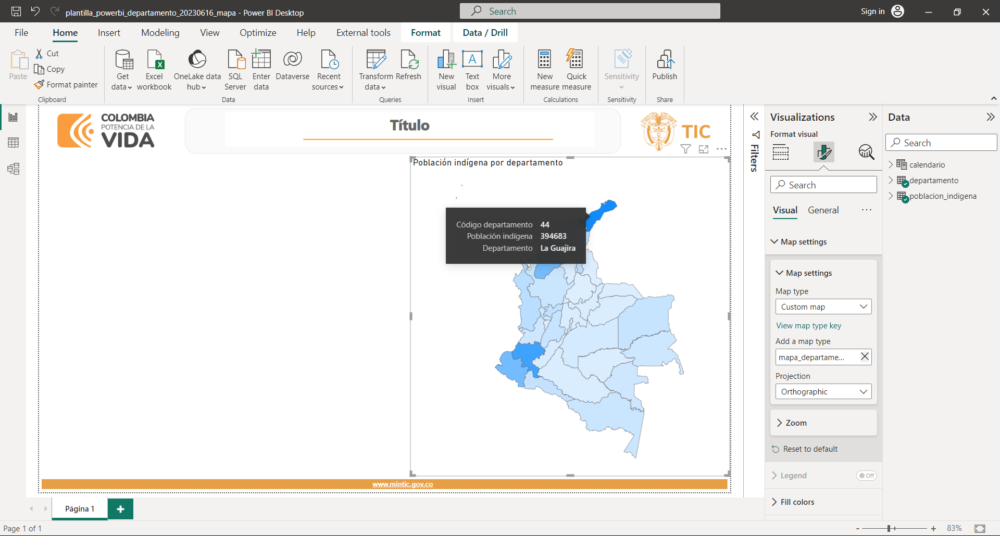
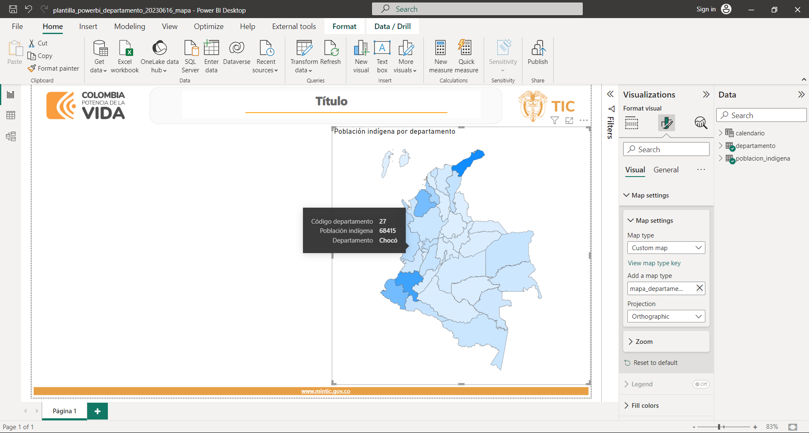
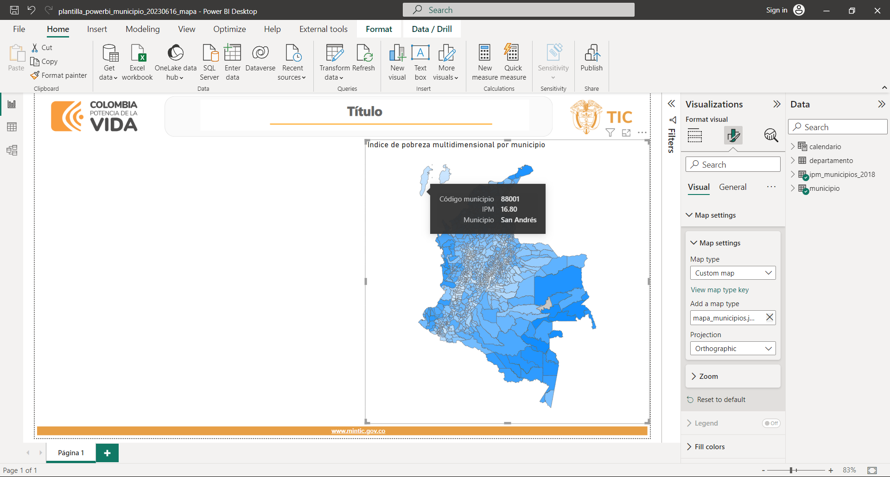

# TopoJSON of Colombia's departments

In this repo I provide Python notebooks that document the work I performed to create two TopoJSON files to be used in Power BI as shape maps: one of Colombia's departments and one of Colombia's towns. These files improve the visualization of a particular deparment so that it looks larger and closer to mainland.

Since the final purpose is to use the files as shape maps in Power BI, they only store the department and town codes since additional department and town-related information can be pulled by making use of Power BI capabilities. The codes are stored in both text and number formats. The official codes, provided by the División Político Administrativa de Colombia (DIVIPOLA), are numbers stored as text. However, when loading these text codes in Power BI, they're automatically converted to numbers. I provide both formats in both files for the sake of completeness.

## Getting started

Please make sure to install Python and the project requirements. The requirements are listed in the file `requirements.txt` and can be installed in a Linux terminal with the following command:[^1]

[^1]: Note the `python -m` at the beggining of the command. While running `pip` this way inside a virtual environment is not necessary, it's good practice to run it this way. See [Why you should use `python -m pip`](https://snarky.ca/why-you-should-use-python-m-pip/) for an explanation about running `pip` with and without `python -m`.

```bash
python -m pip install -r requirements.txt
```

You can do the same with the file `dev-requirements.txt`. This file lists some linting and code formatting libraries that can be used with a source-code editor like VS Code.

To make sure the notebooks work properly, you have to:

1. Run the notebook `modify_map.ipynb` (located in the folder **existing_topojson_map**). This will create the file `mapa_departamentos.json` that is used in step 3.
2. Download the GeoJSON files mentioned in the notebook `create_map.ipynb` (located in the folder **new_topojson_map**) and place them in the same folder where the notebook is.
3. Run the notebook `create_map.ipynb`.

In addition, the notebook `create_from_shapefile.ipynb` (located in the folder **from_shapefiles**) creates the TopoJSON maps from Esri shapefiles. These shapefiles are updated more frequently than the GeoJSON files. Thus, recent border changes in Colombian territories are more likely reflected in the former. Make sure to download the shapefiles mentioned in this notebook and place them in the corresponding subfolders. They're compressed files, so make sure to extract the source files.

## Notebooks

### modify_map

This notebook documents an exploration work aimed at understanding what kind of information was contained in a TopoJSON of Colombia's towns and departments downloaded from Internet. The idea was to extract the information linked only to departments.

While I was able to extract such information, there were some visualization issues related to the archipelago of San Andrés, Providencia and Santa Catalina. In particular, the archipelago looks pretty small and far from mainland. While this reflects reality, it isn't visually appealing. Figure 1 below shows the result.

<p style="line-height:0.5" align="center">
    
</p>
<p style="line-height:0.5" align="center"><b>Figure 1.</b> Shape map of Colombia's departments in Power BI.</p>

### create_map

This notebook documents the work that solves the visualization issues with the archipelago mentioned above.

When looking at departments, San Andrés, Providencia and Santa Catalina belong to the same department and are grouped under a single multipolygon. The work to improve the visualization can be summarized in the following steps:

1. Get a GeoJSON of Colombia's departments
2. Detach San Andrés from Providencia and Santa Catalina and move them closer together
3. Attach the islands back together and increase the whole archipelago size
4. Move the whole archipelago closer to mainland
5. Convert the updated GeoJSON to TopoJSON

Figure 2 below shows the result.

<p style="line-height:0.5" align="center">
    
</p>
<p style="line-height:0.5" align="center"><b>Figure 2.</b> Updated shape map of Colombia's departments in Power BI.</p>

When looking at towns, San Andrés is treated as a town and Providencia and Santa Catalina as another town and each is grouped under its own multipolygon (San Andrés has three small surrounding islands and all four islands are grouped under a single multipolygon). The work to improve the visualization can be summarized in the following steps:

1. Get a GeoJSON of Colombia's towns
2. Increase the size of both towns
3. Move San Andrés closer to mainland
4. Move Providencia and Santa Catalina closer to mainland
5. Convert the updated GeoJSON to TopoJSON

While simple in nature, especially after having worked with the departments, care is needed in step 4. Please refer to the notebook for details. Figure 3 below shows the result.

<p style="line-height:0.5" align="center">
    
</p>
<p style="line-height:0.5" align="center"><b>Figure 3.</b> Updated shape map of Colombia's towns in Power BI.</p>

### create_from_shapefile

This notebook replicates the work done with the departments and towns GeoJSON files but using corresponding Esri shapefiles. The notebook is cleaner and shorther thanks to the above learning. From the publicly available official Colombian geographic files, it seems the shapefiles are updated more frequently than the GeoJSON files. In fact, the 2018 GeoJSON files are outdated since there were recent border changes in some Colombian territories. These changes are captured in the most recent version of the shapefiles, dated 2022.

In addition, I provide the final TopoJSON files. I created two versions to illustrate the differences that result when modifying the *quantization* parameter in **geo2topo**. For example, for the departments work, the two files are located in the folder **from_shapefiles/departamentos**:

- mapa_departamentos.json: I use a quantization parameter equal to 1e4. The size of the resulting file is ~1.2 MB.
- mapa_departamentos_q3.json: I use a quantization parameter equal to 1e3. The size of the resulting file is ~200 KB.

Figure 4 below shows the result when using a quantization equal to 1e3.

<p style="line-height:0.5" align="center">
    
</p>
<p style="line-height:0.5" align="center"><b>Figure 4.</b> Shape map of Colombia's departments in Power BI using latest available official geographic information and modified quantization.</p>

For the towns work, the resulting files are located in the folder **from_shapefiles/municipios**.

## Credits

This project was motivated by the work of John Guerra. Check [his forum on GeoJSON map of Colombia](https://gist.github.com/john-guerra/43c7656821069d00dcbc) for a foretaste.

I highly appreciate feedback and you can reach out to me on [LinkedIn](https://bit.ly/jaime-linkedin) any time. I'm also working on other projects. Check this out in my [personal website](https://bit.ly/jaime-website).

Thanks for reading!
